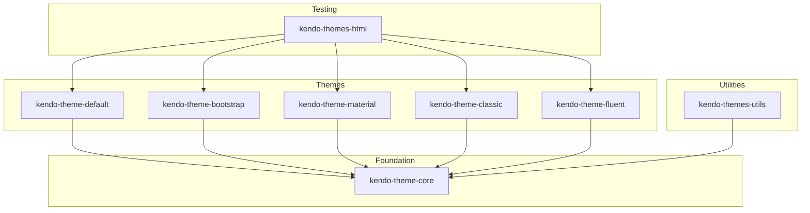

# Repo Orientation — Copilot Prompt

## Instructions

Copy this prompt into Copilot Chat to generate the architecture diagram.

---

## Prompt

```
I need to create a Mermaid architecture diagram for the kendo-themes monorepo.

Based on the package.json files in the repository, generate a Mermaid flowchart showing:

1. The @progress/kendo-theme-core package as the foundation
2. The 5 theme packages (default, bootstrap, material, classic, fluent) depending on core
3. The @progress/kendo-themes-utils package depending on core
4. The @progress/kendo-themes-html package depending on the theme packages

Use this structure:
- graph TD (top-down)
- Subgraphs for "Foundation", "Themes", "Utilities", "Testing"
- Arrows showing dependencies (A --> B means A depends on B)
- Clean labels without @ symbols

Output only the Mermaid code block, ready to save to docs/architecture.mmd
```

---

## Expected Output Format



---

## After Generation

1. Review the diagram for accuracy
2. Save to `docs/architecture.mmd`
3. Open in Mermaid Preview to verify rendering
4. Commit with: `git commit -m "docs(architecture): add monorepo package dependency diagram"`

---

## PR Summary Snippet

```markdown
### Summary
Added architecture diagram documenting package dependencies in the kendo-themes monorepo.

### Changes
- Created `docs/architecture.mmd` with Mermaid flowchart
- Shows core → themes → html dependency chain
- Documents utils as standalone package

### Testing
- Diagram renders correctly in Mermaid Preview
- No code changes; documentation only
```
