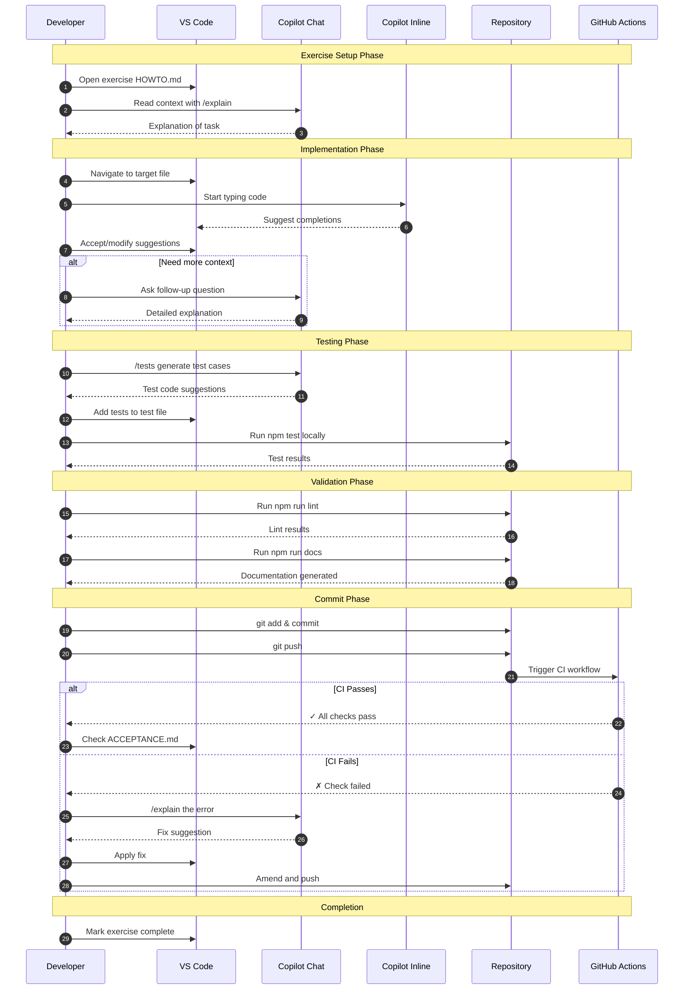
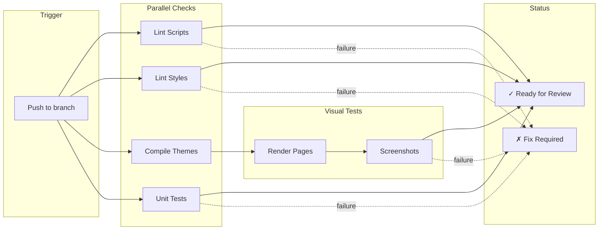

# Crawl Track Workflow

This document describes the interaction model between developers, Copilot, and the repository during Crawl-level exercises.

## Workflow Diagram



## Copilot Commands Reference

| Command | When to Use | Example |
|---------|-------------|---------|
| `/explain` | Understand existing code | "Explain how this mixin works" |
| `/tests` | Generate test cases | "Generate tests for this variable" |
| `/fix` | Debug an error | "Fix this Stylelint error" |
| `/doc` | Generate documentation | "Add SassDoc comments" |

## Local Validation Commands

```bash
# Quick check (run before every commit)
npm run lint && npm run test:units

# Full validation (run before PR)
npm run docs && npm run sass && npm run lint && npm run test:units

# Single component test
npm run test:units -- --testPathPattern=button
```

## CI Pipeline Overview



## Crawl Guardrails

1. **Always run local tests** before pushing
2. **Keep diffs small** (< 50 lines preferred)
3. **One logical change** per commit
4. **Update tests** when changing behavior
5. **Document public APIs** with SassDoc

## Fallback: No CI Available

If CI is unavailable or you're working on a fork:

```bash
# Run the full validation suite locally
npm run docs && \
npm run sass && \
npm run lint && \
npm run test:units && \
echo "✓ All local checks pass"
```

## Branch Naming Convention

```
learn/crawl/<username>-<date>-<exercise-slug>
```

Example: `learn/crawl/epetrov-20260105-repo-orientation`
